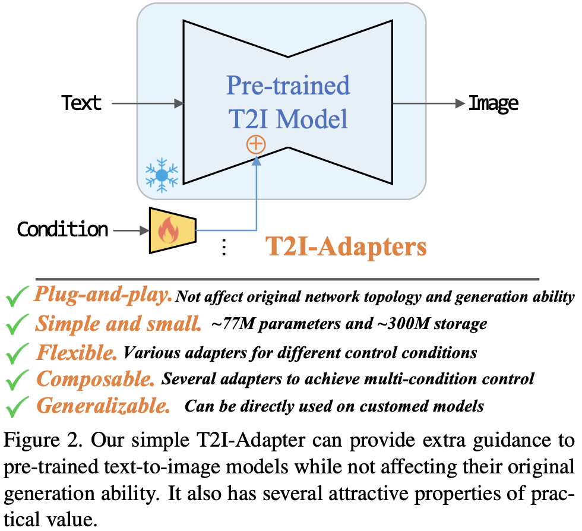
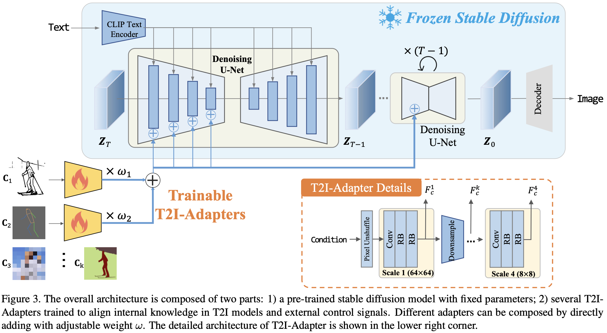
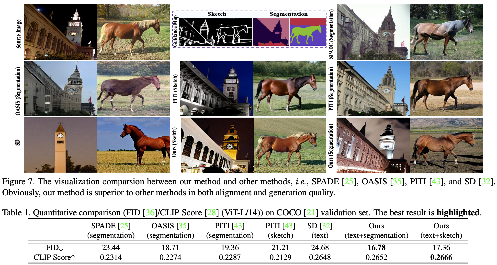

# T2I-Adapter

Author: <a href="https://yusijin02.github.io/">Sijin Yu</a>

> **标题**: T2I-Adapter: Learning Adapters to Dig out More Controllable Ability for Text-to-Image Diffusion Models
>
> **会议/期刊**: AAAI 2024
>
> **GitHub**: https://github.com/TencentARC/T2I-Adapter

[TOC]

## 1. Abstract

- 大规模文本到图像 (T2I) 模型惊人的生成能力展示了其在学习复杂结构和有意义的语义方面的强大力量.
- 然而, 仅仅依赖文本提示不能完全利用模型学到的知识, 特别是当需要灵活和准确的控制 (例如, 颜色和结构) 时.
- 在这篇论文中, 我们的目标是"挖掘"出T2I模型隐含学习到的能力, 并明确使用它们来更细致地控制生成过程.
- 具体来说, 我们提出学习简单轻量的T2I-适配器, 以将T2I模型中的内部知识与外部控制信号对齐, 同时冻结原始的大型T2I模型.
- 通过这种方式, 我们可以根据不同的条件训练各种适配器, 实现在生成结果的颜色和结构上丰富的控制和编辑效果.
- 此外, 所提出的T2I-适配器具有实用价值的吸引特性, 如可组合性和泛化能力.
- 大量实验表明, 我们的T2I-适配器具有令人期待的生成质量和广泛的应用范围.

## 2. Motivation & Contribution

### 2.1 Motivation

- 尽管基于大数据和强大计算力的文本到图像 (T2I) 生成模型已展现出强大的生成能力, 但它们过度依赖精心设计的提示, 并缺乏灵活的用户控制能力来精确实现用户的想法.

- 对于非专业用户, 生成结果通常不受控制且不稳定. 因此, 本文探讨如何显式地利用T2I模型隐含学习到的高级结构和语义能力, 以更准确地控制生成过程.

### 2.2 Contribution

- 提出了一种简单、高效且有效的T2I-适配器方法, 以低成本将T2I模型的内部知识与外部控制信号进行良好对齐.
- T2I-适配器能够为现有T2I模型提供更准确的可控制指导, 同时不影响其原始生成能力.
- 大量实验表明, 该方法在各种条件下运行良好, 并且这些条件也可以轻松组合以实现多条件控制.
- 所提出的T2I-适配器还具有吸引人的泛化能力, 能够在一些定制模型和粗糙条件 (例如, 手绘风格草图) 上运行.

## 3. Methods

## 4. Experiment

